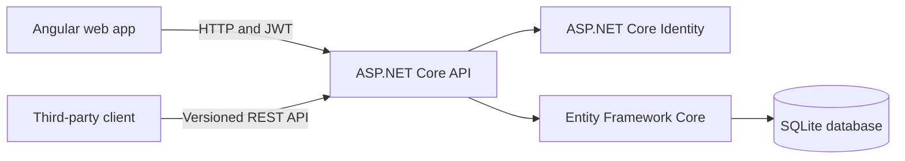

# Architecture and decisions

## Overview

The solution uses a small monorepo with an Angular single-page application and an ASP.NET Core REST API. The API owns authentication, authorization, business rules, and persistence. The web application remains an API client and never makes authorization decisions on behalf of the server.

## Backend

The API is organized around four responsibilities:

- Controllers expose versioned HTTP contracts and status codes.
- Domain entities represent users, posts, topics, comments, likes, and moderation tags.
- Entity Framework Core maps relationships and database constraints.
- Security services issue JWTs and resolve the authenticated user.

SQLite keeps the proof of concept simple to run while still demonstrating relational modeling, indexes, foreign keys, and uniqueness constraints. A production deployment can replace the provider with SQL Server or PostgreSQL without changing the API contracts.

## Authentication and authorization

Registration and login use ASP.NET Core Identity. Passwords are hashed by Identity and are never stored directly. Successful authentication returns a signed JWT containing the user identifier and roles.

Authorization is enforced server-side:

- Anonymous users can read posts and comments.
- Authenticated users can create posts, comment, like, and remove their likes.
- Only users in the Moderator role can add the moderation tag.
- The like endpoint checks that the user is not the post author.
- A composite database key on post and user prevents duplicate likes during concurrent requests.

Signing keys and seeded passwords are loaded from environment variables. They are deliberately absent from source control.

## API design

The initial contract is namespaced under `/api/v1` so later versions can evolve without silently breaking third-party clients. List endpoints use an explicit paged response containing page metadata. Validation failures use ASP.NET Core problem details.

Supported post query parameters:

| Parameter | Description |
| --- | --- |
| `search` | Case-insensitive search across title, content, author, and topic |
| `fromDate` | Include posts created on or after this timestamp |
| `toDate` | Include posts created on or before this timestamp |
| `authorId` | Include posts by one author |
| `topic` | Include posts with one topic |
| `flagged` | Include only flagged or unflagged posts when set to `true` or `false` |
| `sortBy` | `date` or `likes` |
| `sortDirection` | `asc` or `desc` |
| `page` | One-based page number |
| `pageSize` | Number of results, up to 50 |

Every sort ends with deterministic secondary ordering. Like sorting uses creation date and identifier tie-breakers, while date sorting uses the identifier, preventing equal values from shifting between pages.

Comments are deliberately retrieved through `/api/v1/posts/{id}/comments` instead of being embedded without a limit in the post detail response. The endpoint accepts `fromDate`, `toDate`, `authorId`, `sortDirection`, `page`, and `pageSize`, so large conversations remain bounded and independently navigable.

## Frontend

The Angular application uses standalone components, reactive forms, signals, lazy-loaded routes, and a functional HTTP interceptor. Tailwind CSS supplies a responsive design system without coupling the application to a component library.

The access token and user summary are kept in session storage. This is suitable for a short proof of concept because the session is cleared when the browser session ends. For production, a secure same-site HTTP-only cookie with anti-forgery protection would reduce token exposure to browser scripts.

## Testing strategy

API integration tests start the real application through `WebApplicationFactory`, replace SQLite with a unique in-memory database, and exercise the HTTP boundary. This verifies routing, model validation, Identity, JWT authentication, authorization policies, persistence, and business rules together.

Angular component and service tests run with Vitest and jsdom. A Playwright test then starts the real API and Angular development server, searches the seeded forum, logs in, publishes a discussion, and verifies the final routed view. This closes the integration gap between isolated backend and frontend checks.

The current suite verifies:

- Anonymous filtered browsing
- Authentication requirements
- Authenticated post creation
- Self-like rejection
- Duplicate-like conflict handling
- Moderator-only tagging
- Server-side full-forum search
- Author discovery and paged comment filtering
- Login validation and moderator UI gating
- Angular-to-API browser workflow

## Proof-of-concept trade-offs

- `EnsureCreated` is used for zero-step local setup. Production should use reviewed EF Core migrations.
- Seeded data is created at startup. Production seeding should be separated from application startup.
- SQLite is ideal for the assessment but a managed relational database is preferable for scale and concurrency.
- Search uses escaped SQL `LIKE` expressions across the relational dataset. Production scale could justify database full-text search or a dedicated search service.
- Tokens are short-lived, but refresh tokens and revocation are outside the assessment scope.

## Production evolution

Recommended next steps are managed secrets, HTTPS-only hosting, secure cookies, refresh token rotation, rate limiting, structured audit logs, database migrations, richer observability, content sanitization, automated accessibility testing, and deployment environments with approval gates.
